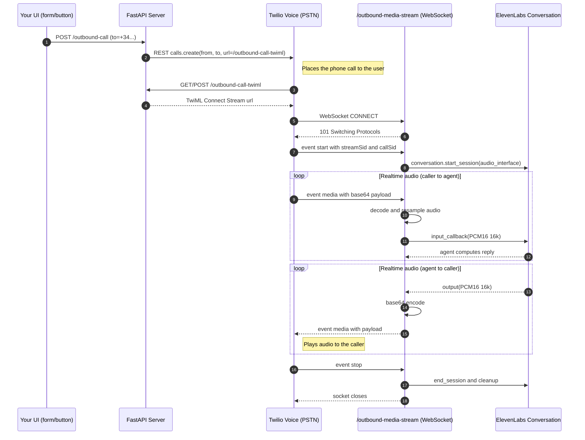

# 🧞‍♂️ Time Traveler Agent

An AI-powered time traveler that calls you from any historical era! Using ElevenLabs Conversational AI and Twilio, this agent embodies characters from Ancient Times to the Far Future (3000+ AD) with era-specific personalities, expressions, and voice characteristics.

## About this project

- **17 Historical Eras**: From Late Bronze Age (1500 BC) to Far Future (3000+ AD) with authentic personalities
- **Multiple agents & personalities**: Several ElevenLabs agents with distinct styles; the system selects and adapts personality per era
- **Diverse voices**: Language-specific voice pools with gender/age metadata; voices are randomized while voice settings adapt to the era
- **Bilingual Immersion**: Complete English/Spanish support with era-specific expressions
- **Beautiful UI**: Modern, responsive frontend with stunning animations and user experience
- **Real-Time Audio**: Seamless Twilio ↔ ElevenLabs integration with optimized audio conversion
- **Smart Randomization**: Voice and agent selection with character consistency
- **Production Ready**: Complete deployment infrastructure with comprehensive documentation
- **Bulletproof Testing**: 100% test coverage of critical paths with robust error handling

### Technical Excellence
- **WebSocket Mastery**: Real-time audio streaming with Twilio Media Streams
- **Era Intelligence**: Dynamic variable injection for authentic historical context
- **Voice Adaptation**: Era-specific voice characteristics (speed, stability, style)
- **Error Resilience**: Comprehensive fallback systems and graceful degradation
- **Developer Experience**: Complete setup guides, testing infrastructure, and deployment automation

### Architecture Highlights
- **Modular Design**: Clean separation between server logic, shared modules, and tests
- **JWT Authentication**: Secure token-based authentication with configurable expiration
- **Rate Limiting**: Built-in sliding window rate limiting (5 calls/5min per token)
- **Type Safety**: Python dataclasses for era configuration with validation  
- **Randomization**: Language-based voice selection + personality-based agent selection
- **Character Consistency**: Voice metadata ensures character-voice alignment
- **Immersive Experience**: Era-specific first messages and voice settings
- **Testing**: 49 unit tests covering all core logic with comprehensive coverage
- **Poetry Management**: Root-level dependency management for easy testing and CI/CD

## Features

- **Live Phone Calls**: Real-time conversations via Twilio integration
- **Dynamic Context**: ElevenLabs agents receive era-specific prompts and expressions
- **JSON API**: Simple REST API for initiating calls with `{to, lang, year}` parameters
- **JWT Authentication**: Secure token-based authentication for all API endpoints
- **Rate Limiting**: Built-in protection against abuse with configurable limits
- **Status Monitoring**: Real-time rate limit status and call monitoring endpoints

## 🔄 How It Works

The system delivers an **outbound voice experience**: a visitor submits a form (phone, language, year) and immediately receives a call. On pickup, a **live ElevenLabs Agent** converses naturally with era-flavored style.

### Complete Call Flow



## 🚀 Quick Start

For complete, detailed instructions, see:
- Backend: [apps/server/README.md](apps/server/README.md)
- Frontend (web): [apps/web/README.md](apps/web/README.md)

### 1. Start the Server
```bash
cd apps/server
# Install dependencies with Poetry (creates/uses a virtualenv)
poetry install

# Run the API
poetry run uvicorn main:app --host 0.0.0.0 --port 8000 --reload
```

### 2. Start ngrok (separate terminal)
```bash
ngrok http 8000
```

### 3. Get JWT Token
```bash
# Get authentication token
curl -X POST https://YOUR_NGROK_URL/auth/login
```

### 4. Make a Call
```bash
# Use the token from step 3
curl -X POST https://YOUR_NGROK_URL/outbound-call \
  -H "Content-Type: application/json" \
  -H "Authorization: Bearer YOUR_JWT_TOKEN_HERE" \
  -d '{
    "to": "+1234567890",
    "lang": "en",
    "year": 1350
  }'
```

 
## 🔧 Configuration

### Environment Variables

**Backend (`apps/server/.env`)**
```bash
# ElevenLabs Configuration
ELEVENLABS_API_KEY=sk_...
ELEVENLABS_AGENT_ID_1=agent_...
ELEVENLABS_AGENT_ID_2=agent_...  # Optional
ELEVENLABS_AGENT_ID_3=agent_...  # Optional

# Twilio Configuration
TWILIO_ACCOUNT_SID=AC...
TWILIO_AUTH_TOKEN=...
TWILIO_PHONE_NUMBER=+1...

# JWT Authentication
JWT_SECRET=your_secure_jwt_secret_here
JWT_EXPIRATION_HOURS=24

# Rate Limiting (Optional - defaults shown)
RATE_LIMIT_CALLS=5
RATE_LIMIT_WINDOW_MINUTES=5

# CORS and Debug
ALLOWED_ORIGINS=http://localhost:3000,https://your-app.vercel.app
DEBUG_LOGS=true
```

**Frontend (`apps/web/.env.local`)**
```bash
NEXT_PUBLIC_BACKEND_URL=https://your-railway-app.railway.app
```

### ElevenLabs Agent Setup
Configure your agent with dynamic variables in the system prompt:
```
You are a time traveler from the year {{era_year}} during the {{time_period}}.
LANGUAGE: Always respond in {{language_name}}.
PERSONALITY: Use these expressions naturally: "{{expression_1}}", "{{expression_2}}", "{{expression_3}}"
```

See `apps/server/AGENT_SETUP.md` for complete configuration guide.

## 🔐 JWT Authentication

The API uses JWT (JSON Web Tokens) for secure authentication. All endpoints require a valid token.

### Generate JWT Secret
```bash
# Generate a secure secret for your .env file
python3 -c "import secrets; print(secrets.token_urlsafe(32))"
```

### Authentication Flow
1. **Get Token**: `POST /auth/login` - Returns JWT token
2. **Use Token**: Include `Authorization: Bearer TOKEN` in API calls
3. **Refresh Token**: `POST /auth/refresh` - Get new token before expiration
4. **Verify Token**: `GET /auth/verify` - Check if token is valid

### Example Usage
```bash
# 1. Get token
TOKEN=$(curl -s -X POST https://your-api.com/auth/login | jq -r '.token')

# 2. Check rate limit status (optional)
curl -X GET https://your-api.com/rate-limit/status \
  -H "Authorization: Bearer $TOKEN"

# 3. Make authenticated call
curl -X POST https://your-api.com/outbound-call \
  -H "Authorization: Bearer $TOKEN" \
  -H "Content-Type: application/json" \
  -d '{"to":"+1234567890","lang":"en","year":1350}'
```

### Rate Limiting
The API includes built-in rate limiting to prevent abuse:
- **Default**: 5 calls per 5-minute window per token
- **Configurable**: Set `RATE_LIMIT_CALLS` and `RATE_LIMIT_WINDOW_MINUTES` in environment
- **Sliding Window**: Uses a sliding window approach for fair rate limiting
- **Status Endpoint**: Check current rate limit status with `GET /rate-limit/status`
- **Error Response**: Returns HTTP 429 with detailed rate limit information when exceeded

## API Endpoints

### Public
- `GET /` - Root
- `GET /health` - Health check

### Authentication
- `POST /auth/login` - Get JWT token
- `POST /auth/refresh` - Refresh existing token
- `GET /auth/verify` - Verify token validity

### Core Functionality
- `OPTIONS /outbound-call` - CORS preflight handler
- `POST /outbound-call` - Initiate time traveler call (requires auth)
- `GET /outbound-call-twiml` - TwiML for Twilio webhook
- `POST /outbound-call-twiml` - TwiML webhook (Twilio may POST)
- `WS /outbound-media-stream` - WebSocket for real-time audio

### Monitoring & Status
- `GET /rate-limit/status` - Check current rate limit status (requires auth)
- `GET /call-status/{callSid}` - Get call status (requires auth)
- `POST /end-call/{callSid}` - End active call (requires auth)
- `GET /config` - Get server configuration (debug)

## Project Structure

### Complete Repository Layout

```
time-traveler/
├─ apps/
│  ├─ web/                      # Next.js (Vercel) UI
│  │  ├─ src/app/               # Next.js app directory
│  │  ├─ src/components/        # React components
│  │  └─ package.json           # Frontend dependencies
│  └─ server/                   # FastAPI backend with modular architecture
│     ├─ main.py                # API endpoints & orchestration
│     ├─ auth.py                # JWT authentication & user management
│     ├─ rate_limiting.py       # Rate limiting logic & storage
│     ├─ twilio_audio.py        # Twilio audio bridge & WebSocket handler
│     ├─ era_config.py          # Era definitions and voice settings
│     ├─ errors.py              # Error handling
│     └─ pyproject.toml         # Server dependencies (Poetry)
├─ apps/server/shared_py/       # Python shared modules
│  ├─ data/                     # JSON data files (voices, agents, first messages)
│  ├─ voice_manager.py          # Voice randomization logic
│  ├─ agent_manager.py          # Agent randomization logic
│  └─ first_message_manager.py  # First message selection
├─ apps/server/metrics/         # Latency metrics, snapshots, and UI config
├─ tests/                       # Unit tests (pytest)
│  ├─ test_voice_manager.py
│  ├─ test_agent_manager.py
│  ├─ test_era_config.py
│  ├─ test_rate_limiting.py
│  └─ conftest.py
├─ infra/
│  ├─ deployment/               # Deployment guides (Vercel + Railway)
│  │  └─ README.md
│  └─ twilio/                   # Twilio setup and configuration
│     └─ README.md
├─ pyproject.toml               # Root Poetry project for testing
├─ poetry.lock                  # Root dependency lock file
├─ README.md                    # Root documentation (you are here)
└─ package.json                 # JS workspaces root (web + shared-ts)
```

<!-- Backend architecture overview intentionally omitted; see apps/server/README.md for full details. -->

### Module Responsibilities
- **`main.py`** - API endpoint definitions, request/response handling, business logic orchestration
- **`auth.py`** - JWT token creation/validation, user authentication, session management
- **`rate_limiting.py`** - Rate limit checking/enforcement, token-based limiting, memory management
- **`twilio_audio.py`** - Twilio Media Streams integration, audio conversion
- **`era_config.py`** - Historical era definitions, voice settings, expressions
- **`shared_py/`** - Reusable modules for voice/agent management and randomization

### Architecture Benefits

The modular design provides several advantages:

- **Single Responsibility**: Each module has one clear purpose
- **Testability**: Modules can be tested independently with focused unit tests
- **Reusability**: Auth and rate limiting modules can be used by other services
- **Maintainability**: Changes to one module don't affect others
- **Scalability**: Modules can be moved to separate services as the project grows

### Testing Philosophy

Run tests with Poetry at the repo root:
```bash
poetry run pytest -q
```
Or run a specific module, e.g.:
```bash
poetry run pytest tests/test_rate_limiting.py -q
```

## Example Conversations

**Medieval Knight (1350, Spanish):**
> "¡Por mi fe! En estos tiempos oscuros, ¿qué extraña magia es esa que te permite hablar conmigo a través del tiempo?"

**1970s Hippie (1970, English):**
> "Far out, man! The space age is upon us and you're like, calling from the future? That's totally groovy!"

**AI Renaissance (2035, English):**
> "The neural networks whisper such wisdom... My AI companion suggests we consider how your primitive devices evolved into our symbiotic consciousness."

## 📊 Performance & Latency Testing

Performance metrics and latency testing results are available in [`apps/server/metrics/`](apps/server/metrics/README.md), including:

- **Setup latency**: WebSocket connection to first audible audio
- **Turn-by-turn metrics**: User speech → agent response timing
- **Model comparison**: LLM and TTS performance across different agents
- **Audio streaming**: Chunk cadence and quality metrics

See the metrics folder for detailed test setup, methodology, and results.

## Future Improvements

1. **Extended agent memory**: Persist conversational memory in a database to recall prior calls and tailor responses
2. **Advanced rate limiting & monitoring**: More granular quotas, per-route policies, dashboards, and deeper test coverage
3. **Live tool access for the agent**: Controlled tools (search, retrieval, functions) with auditing and safety rails

Built with ❤️ using ElevenLabs, Twilio, and FastAPI.