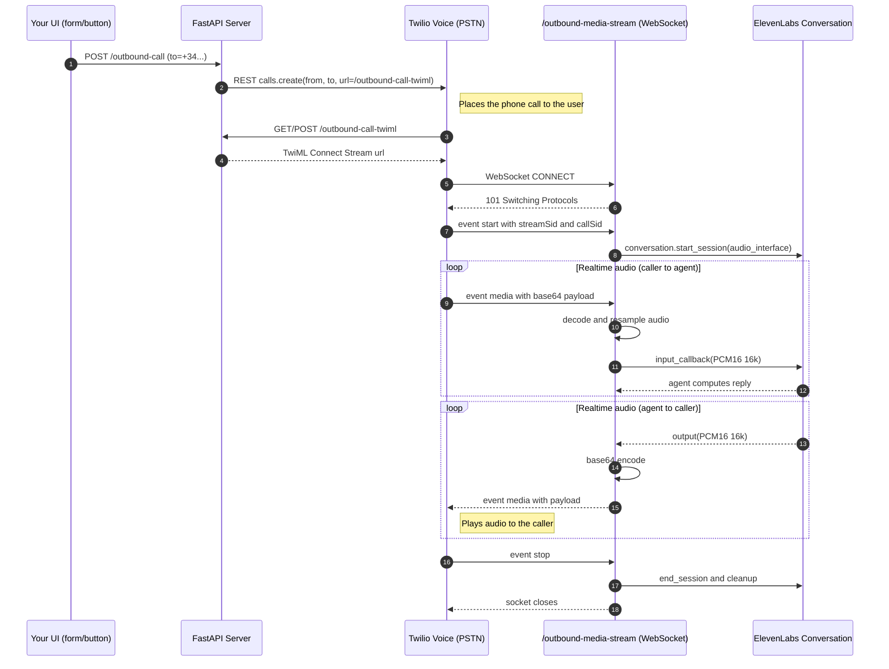

# Time-Traveler Hotline — MVP Repo Guide (PRD + TRD)

A compact, single-page reference for structure, flow, and how to run.

---

## Overview

This project delivers an **outbound voice experience**: a visitor submits a form (phone, language, year) and immediately receives a call. On pickup, a **live ElevenLabs Agent** converses naturally with era-flavored style.  

- **Web (Next.js / Vercel)** – minimal form to trigger the call.  
- **Server (FastAPI)** – initiates **Twilio** outbound call and bridges **Twilio Media Streams** ↔ **ElevenLabs Agent** for real-time conversation.  
- **Shared content** – era “vibe” packs + curated voice IDs, consumed by both apps.

---

## High-Level Call Flow

# right now, the chart looks like this

---


---

## Repository Structure

```
time-traveler/
├─ apps/
│  ├─ web/                      # Next.js (Vercel) UI
│  └─ server/                   # FastAPI backend with era config
│     ├─ main.py               # FastAPI app with /outbound-call endpoints
│     ├─ twilio_audio.py       # Twilio audio bridge & WebSocket handler
│     ├─ era_config.py         # Era definitions and voice settings
│     └─ pyproject.toml        # Server dependencies (Poetry)
├─ apps/server/shared_py/       # Python shared modules
│  ├─ data/                     # JSON data files
│  │  ├─ voices.json            # Voice IDs with gender/age metadata
│  │  ├─ agents.json            # Agent personalities
│  │  └─ first_messages.json    # Era-specific greetings
│  ├─ voice_manager.py          # Voice randomization logic
│  ├─ agent_manager.py          # Agent randomization logic
│  └─ first_message_manager.py  # First message selection
├─ tests/                      # Unit tests (pytest)
│  ├─ test_voice_manager.py    # Voice manager tests
│  ├─ test_agent_manager.py    # Agent manager tests
│  ├─ test_era_config.py       # Era configuration tests
│  └─ conftest.py              # Test fixtures and setup
├─ infra/
│  ├─ deployment/              # Deployment guides (Vercel + Railway)
│  │  └─ README.md             # Complete deployment guide
│  ├─ twilio/                  # Twilio setup and configuration
│  │  └─ README.md             # Twilio voice setup guide
│  └─ docker/                  # Dockerfiles/compose (optional)
├─ scripts/                    # Dev helpers (no app logic)
├─ pyproject.toml              # Root Poetry project for testing
├─ poetry.lock                 # Root dependency lock file
├─ README.md
└─ package.json                # JS workspaces root (web + shared-ts)
```

### Folder Purposes (concise)

* **apps/web/** – Public UI (form).

  * `src/app/page.tsx` — landing form.
  * *(Optional)* `src/app/api/call/route.ts` — proxy → backend `/outbound-call`.
  * `src/components/` — `YearSlider`, `PhoneInput`, `VoiceSelect`.
  * **Env:** `apps/web/.env.local` with only `NEXT_PUBLIC_*` vars.

* **apps/server/** – FastAPI backend with era configuration.

  * `main.py` — routes: `POST /outbound-call`, `GET|POST /outbound-call-twiml`, `WS /outbound-media-stream`.
  * `twilio_audio.py` — μ-law 8k ↔ PCM16 16k bridge + WebSocket handler + ElevenLabs integration.
  * `era_config.py` — map year → era configurations with voice settings and expressions.
  * `pyproject.toml` — Poetry dependencies for server.
  * **Env:** `apps/server/.env` (secrets, git-ignored).

* **apps/server/shared_py/** — Python shared modules for voice/agent management.

  * `data/voices.json` — curated voice IDs by language with gender/age metadata.
  * `data/agents.json` — agent personalities for randomization.
  * `data/first_messages.json` — era-specific greeting messages by language.
  * `voice_manager.py` — voice randomization logic with metadata support.
  * `agent_manager.py` — agent selection and environment variable handling.
  * `first_message_manager.py` — era-appropriate first message selection.

* **tests/** — Unit tests for all core logic.

  * `test_voice_manager.py` — voice randomization and language-based selection tests.
  * `test_agent_manager.py` — agent selection and environment variable tests.
  * `test_era_config.py` — era mapping and configuration validation tests.
  * `conftest.py` — pytest fixtures and shared test setup.


* **infra/** — Deployment and platform configuration guides.
  * `deployment/README.md` — Complete deployment guide for Vercel + Railway.
  * `twilio/README.md` — Twilio voice setup, webhooks, and testing guide.
  * `docker/` — Docker configuration (optional).

* **scripts/** — Convenience scripts (start dev server + ngrok, sample curl).

---

## PRD (MVP)

* **Goal:** After form submit, user gets a **live** call from a “Time Traveler” (ES/EN) with era-flavored cadence.
* **In scope:** UI form → backend outbound call; Twilio Media Streams; ElevenLabs Agent (barge-in ON, short turns).

---

## TRD (MVP)

**Frontend (Next.js / Vercel)**

* Posts to backend `POST /outbound-call` with body `{ to, lang, year}`.

**Backend (FastAPI)**

* `POST /outbound-call` → Twilio `Calls.create(from, to, url=/outbound-call-twiml?year&lang)` (initiates outbound call)
* `GET|POST /outbound-call-twiml` → TwiML `<Connect><Stream wss://.../outbound-media-stream>` (pass year/lang as `<Parameter>`)
* `WS /outbound-media-stream` → Handle Twilio events:

  * `start` — open ElevenLabs Conversation with dynamic variables `{era_year, time_period, era_context, expressions, voice_gender, voice_age_range}`.
  * `media` — convert Twilio μ-law 8k → PCM16 16k, feed agent; send agent audio back as base64 `media`.
  * `stop` — end session, cleanup.

**Audio & Barge-in**

* Convert μ-law 8k → PCM16 16k before feeding the agent; agent output is PCM16 16k; send back as Twilio `media` events.
* On user speech, call `interrupt()` to clear outgoing audio quickly.

**Agent (ElevenLabs)**

* Randomized Agent; barge-in enabled; short responses (≤3 sentences).
* System prompt receives dynamic variables: era context, expressions, voice metadata for character consistency.
* Features: Era-specific first messages, voice-character matching, conversation overrides.
* Dynamic variables: `{era_year, time_period, era_name, era_context, language, language_name, expression_1, expression_2, expression_3, voice_gender, voice_age_range}`.

**Security**

* JWT authentication for all API endpoints; HTTPS/WSS; verify Twilio signatures (post-MVP); git-ignore env files; basic per-phone rate limit if needed.

**Deployment**

* Web → Vercel.
* Server → Railway with public HTTPS (ngrok for dev).
* Twilio number (voice capable) with webhook configured to `/outbound-call`.

---

## Environment Variables

**Backend (`apps/server/.env`)**

```
ELEVENLABS_API_KEY=sk_...
ELEVENLABS_AGENT_ID_1=agent_...
ELEVENLABS_AGENT_ID_2=agent_...  # Optional
ELEVENLABS_AGENT_ID_3=agent_...  # Optional
TWILIO_ACCOUNT_SID=AC...
TWILIO_AUTH_TOKEN=...
TWILIO_PHONE_NUMBER=+1...
JWT_SECRET=your_secure_jwt_secret_here
JWT_EXPIRATION_HOURS=24
ALLOWED_ORIGINS=http://localhost:3000,https://your-app.vercel.app
DEBUG_LOGS=true
```

**Frontend (`apps/web/.env.local`)**

```
NEXT_PUBLIC_BACKEND_URL=https://your-railway-app.railway.app
# (No secrets here)
```

---

## Quickstart (Dev)

```bash
# Backend
cd apps/server
poetry install
poetry run uvicorn main:app --reload --port 8000
ngrok http 8000   # copy HTTPS URL for Twilio webhook configuration

# Test authentication and call (replace with your ngrok URL)
# 1. Get JWT token
curl -X POST "https://your-ngrok-url.ngrok.io/auth/login"

# 2. Use token to make call (replace YOUR_TOKEN with actual token)
curl -X POST "https://your-ngrok-url.ngrok.io/outbound-call" \
  -H "Content-Type: application/json" \
  -H "Authorization: Bearer YOUR_TOKEN" \
  -d '{"to":"+1XXXXXXXXXX","year":1580,"lang":"es"}'

# Run tests from root
cd ../../  # back to root
poetry install  # install test dependencies at root level
poetry run pytest tests/ -v

# Frontend (optional later)
cd apps/web
pnpm i
pnpm dev
# set NEXT_PUBLIC_BACKEND_URL in apps/web/.env.local to your server URL
```

